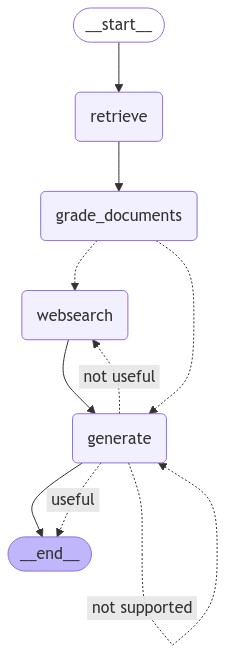
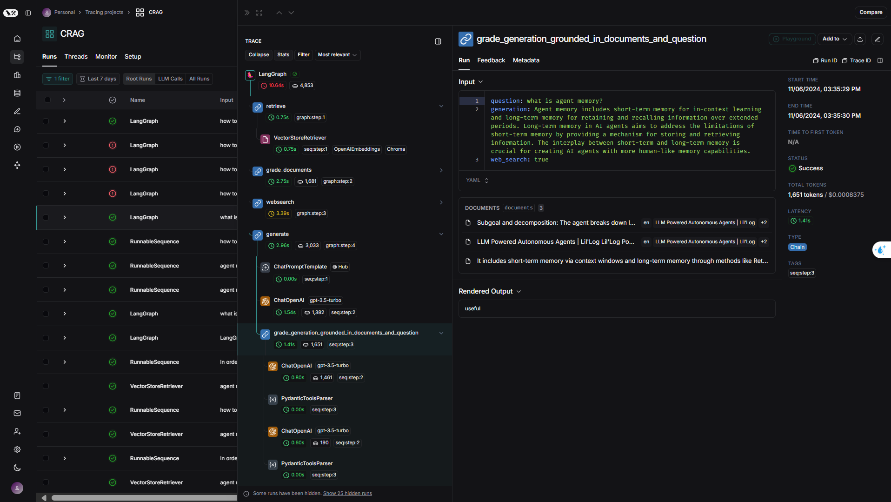

# Corrective, Self, and Adaptive RAG Models with LangGraph

This repository showcases the implementation of three Retrieval-Augmented Generation (RAG) models using LangGraph: Corrective-RAG, Self-RAG, and Adaptive-RAG. These models combine the strengths of both retrieval-based and generative models, making them highly effective for tasks that require generating responses grounded in external knowledge sources.

## Features

- **LangGraph Integration**: Utilizes LangGraph to structure the pipeline and logic for the RAG models.
- **Retrieval Module**: Incorporates a document retriever to find relevant information from a dataset.
- **Generative Module**: Uses a generative model (e.g., GPT-3.5-turbo) to create coherent, contextually accurate responses.
- **Corrective Mechanism**: Implements a corrective mechanism to refine and improve the generated responses based on retrieved documents.
- **Flexible and Scalable**: Designed for scalability and customization according to different use cases and datasets.

## Models

### Corrective-RAG

#### Graph Structure

This is the structure of the graph model used in the Corrective-RAG implementation:


### Self-RAG

#### Graph Structure

This is the structure of the graph model used in the Self-RAG implementation:



### Adaptive-RAG

#### Graph Structure

This is the structure of the graph model used in the Adaptive-RAG implementation:


## LangSmith Tracking

You can view the demo of the models on LangSmith using the following link:

### Corrective RAG:


### Self RAG:


### Adaptive RAG:


## Usage

1. **Document Ingestion**:
   - Load and preprocess documents from specified URLs.
   - Split documents into manageable chunks and create embeddings.

   ```sh
   python ingestion.py
   ```

2. **Graph Workflow**:
   - Define and compile the graph workflow for the RAG models.

   ```sh
   python graph/graph.py
   ```

3. **Web Search**:
   - Perform web searches to retrieve additional information.

   ```sh
   python graph/nodes/web_search.py
   ```

4. **Testing**:
   - Run tests to ensure the correctness of the retrieval and generation chains.

   ```sh
   pytest graph/chains/tests/test_chains.py
   ```

## License

This project is licensed under the MIT License. See the `LICENSE` file for more details.

## Acknowledgements

- [LangGraph](https://github.com/langgraph/langgraph) for providing the graph-based framework.
- [LangChain](https://github.com/langchain/langchain) for the document retrieval and generation modules.
- [TavilySearchResults](https://github.com/tavily/tavily-search) for the web search integration.
