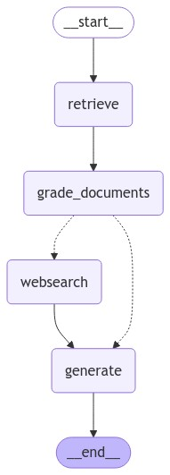
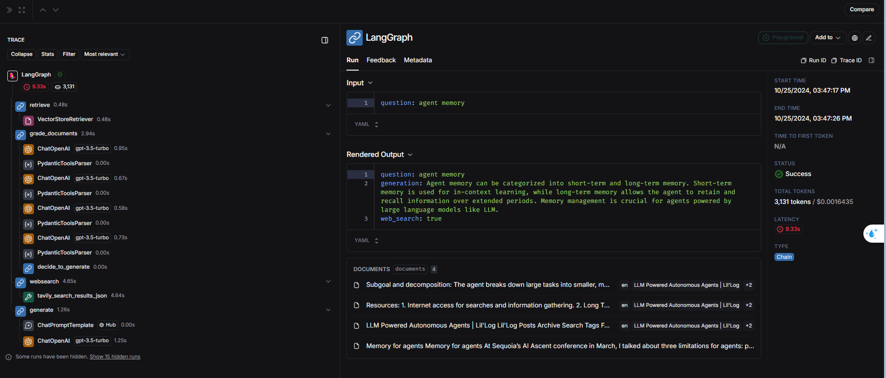

# Corrective RAG Model with LangGraph

This repository showcases the implementation of a Corrective Retrieval-Augmented Generation (RAG) model using LangGraph. Corrective RAG combines the strengths of both retrieval-based and generative models, making it highly effective for tasks that require generating responses grounded in external knowledge sources.

## Features

- **LangGraph Integration**: Utilizes LangGraph to structure the pipeline and logic for the Corrective RAG model.
- **Retrieval Module**: Incorporates a document retriever to find relevant information from a dataset.
- **Generative Module**: Uses a generative model (e.g., GPT-3.5-turbo) to create coherent, contextually accurate responses.
- **Corrective Mechanism**: Implements a corrective mechanism to refine and improve the generated responses based on retrieved documents.
- **Flexible and Scalable**: Designed for scalability and customization according to different use cases and datasets.

## Graph Structure

This is the structure of the graph model used in the Corrective RAG implementation:



## LangSmith Tracking

You can view the demo of the model on LangSmith using the following link:

[LangSmith Tracking Demo](https://smith.langchain.com/public/3d6c8db8-4833-4205-b456-213684d7de0a/r)



## Usage

1. **Document Ingestion**:
    - Load and preprocess documents from specified URLs.
    - Split documents into manageable chunks and create embeddings.

    ```sh
    python ingestion.py
    ```

2. **Graph Workflow**:
    - Define and compile the graph workflow for the Corrective RAG model.

    ```sh
    python graph/graph.py
    ```

3. **Web Search**:
    - Perform web searches to retrieve additional information.

    ```sh
    python graph/nodes/web_search.py
    ```

4. **Testing**:
    - Run tests to ensure the correctness of the retrieval and generation chains.

    ```sh
    pytest graph/chains/tests/test_chains.py
    ```

## License

This project is licensed under the MIT License. See the `LICENSE` file for more details.

## Acknowledgements

- [LangGraph](https://github.com/langgraph/langgraph) for providing the graph-based framework.
- [LangChain](https://github.com/langchain/langchain) for the document retrieval and generation modules.
- [TavilySearchResults](https://github.com/tavily/tavily-search) for the web search integration.